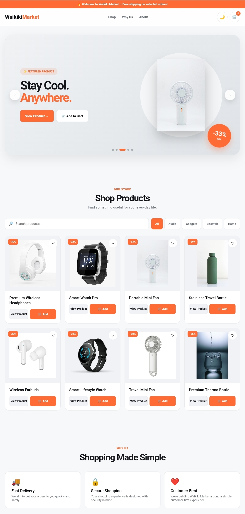
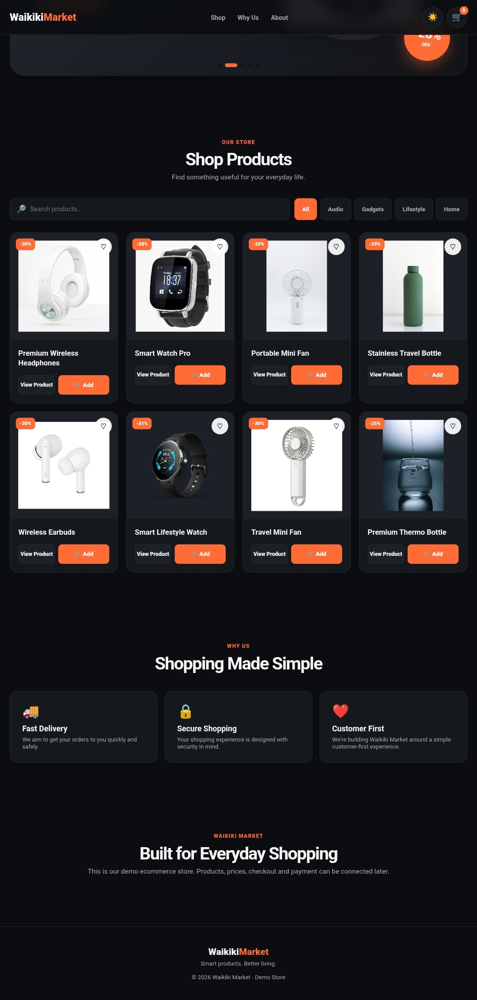

# 🛍️ Waikiki Market

A modern and responsive demo e-commerce website built with HTML, CSS, and JavaScript.

Waikiki Market is a front-end portfolio project designed to demonstrate a clean, interactive, and responsive online shopping experience.

---

## 🌐 Live Demo

### 👉 [Visit Waikiki Market](https://venerable-pithivier-03c209.netlify.app/)

---

## 📸 Preview

### ☀️ Light Mode

### 🌙 Dark Mode

---

## ✨ Features

- 🛍️ Modern e-commerce interface
- 📱 Responsive design
- 🎞️ Featured product slider
- 🔎 Product search
- 🗂️ Category filtering
- 👀 Product details modal
- 🛒 Shopping cart
- ➕ Increase and decrease product quantity
- 🗑️ Remove products from cart
- 💾 Local Storage cart persistence
- 🌙 Dark mode
- 🔔 Toast notifications
- 🧾 Demo checkout system
- 🚚 Shipping method selection
- 💳 Multiple demo payment methods
- ✅ Order confirmation screen

---

## 🛒 Product Categories

The demo store currently includes:

- 🎧 Audio
- ⌚ Gadgets
- 🌴 Lifestyle
- 🏠 Home

---

## 🧰 Technologies Used

- HTML5
- CSS3
- JavaScript
- CSS Grid
- CSS Flexbox
- Responsive Media Queries
- Browser Local Storage
